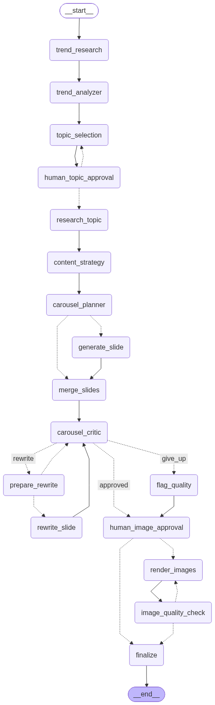

# AI Trend-to-Carousel Agent

> Give it a domain. It finds what people are talking about **right now**, researches it,
> and turns it into a publish-ready 5-slide carousel — as real PNG images.

A teaching project for **LangGraph**: state, nodes, conditional edges, tool calling,
parallel fan-out, structured output, loops, human-in-the-loop interrupts and persistence
— all doing real work rather than illustrating concepts in isolation.

```
Input:   { domain: "AI", audience: "Software Developers", platform: "LinkedIn", slides: 5 }
Output:  5 × 1080×1350 PNG + carousel.json  (topic discovered from live web search)
```

The topic is **never hard-coded**. Every run starts with a live web search.

---

## Table of contents

1. [What it does](#1-what-it-does)
2. [Quick start](#2-quick-start)
3. [Running it](#3-running-it)
4. [The LangGraph architecture](#4-the-langgraph-architecture)
5. [Every node explained](#5-every-node-explained)
6. [Every edge explained](#6-every-edge-explained)
7. [State and reducers](#7-state-and-reducers)
8. [Where each LangGraph concept lives](#8-where-each-langgraph-concept-lives)
9. [The rendering pipeline](#9-the-rendering-pipeline)
10. [Example output](#10-example-output)
11. [Project structure](#11-project-structure)
12. [Configuration](#12-configuration)
13. [Observability](#13-observability)
14. [Troubleshooting](#14-troubleshooting)

---

## 1. What it does

| Stage | What happens | Where |
|---|---|---|
| 1 | Searches the live web for trends in your domain | `nodes/trends.py` |
| 2 | An LLM extracts and **scores** distinct trends | `nodes/trends.py` |
| 3 | Picks one topic and an editorial **angle** | `nodes/trends.py` |
| 4 | *(optional)* Pauses for human approval | `nodes/trends.py` |
| 5 | Researches the topic deeply, labelling FACT / CLAIM / OPINION | `nodes/research.py` |
| 6 | Designs the narrative arc | `nodes/strategy.py` |
| 7 | Plans each slide and its visual type | `nodes/strategy.py` |
| 8 | Writes all 5 slides **in parallel** | `nodes/slides.py` |
| 9 | A critic scores the deck and names weak slides | `nodes/critic.py` |
| 10 | Weak slides are rewritten and re-critiqued (**loop**, max 3) | `nodes/slides.py` |
| 11 | Renders 5 real PNGs via HTML/CSS → Playwright | `rendering/` |
| 12 | Verifies the files and writes `carousel.json` | `nodes/images.py` |

---

## 2. Quick start

```bash
# 1. Install
python -m venv .venv
source .venv/bin/activate          # Windows: .venv\Scripts\activate
pip install -r requirements.txt
playwright install chromium        # the PNG renderer

# 2. Configure
cp .env.example .env
#    then put ONE key in .env:  ANTHROPIC_API_KEY=...  or  OPENAI_API_KEY=...

# 3. Run
python -m app.main --domain "AI" --audience "Software Developers"
```

Web search needs **no key** — it uses DuckDuckGo by default. Add `TAVILY_API_KEY`
for better snippets if you have one.

Output lands in `output/<thread-id>-<topic-slug>/`:

```
slide_01.png … slide_05.png     1080×1350, ready to upload
slide_01.html … slide_05.html   the exact markup each PNG came from
carousel.json                   topic, slides, critique, sources, image check
```

---

## 3. Running it

### CLI

```bash
# the standard demo
python -m app.main --domain "AI" --audience "Software Developers" \
                   --platform "LinkedIn" --slides 5

# with human-in-the-loop gates (LangGraph interrupts)
python -m app.main --domain "DevOps" --audience "SREs" --approve-topic --approve-images

# resume a run that was stopped, using its thread id
python -m app.main --resume --thread-id carousel-20260917-194600

# hand-drawn whiteboard style instead of the clean editorial look
python -m app.main --domain "AI" --audience "Developers" --style sketch

# pick a visual theme, or print the graph
python -m app.main --domain "Data Engineering" --theme carbon
python -m app.main --show-graph
```

### UI

```bash
streamlit run streamlit_app.py
```

Four inputs, a live progress checklist driven by the graph's own node events,
approval buttons when an interrupt fires, and the finished carousel with a
`.zip` download.

---

## 4. The LangGraph architecture

```
                              START
                                │
                      ┌─────────▼─────────┐
                      │  trend_research   │  live web search (tool node)
                      └─────────┬─────────┘
                      ┌─────────▼─────────┐
                      │  trend_analyzer   │  LLM → structured Trend[]
                      └─────────┬─────────┘
                      ┌─────────▼─────────┐
          ┌──────────►│  topic_selection  │  LLM → topic + angle + hook
          │           └─────────┬─────────┘
          │           ┌─────────▼─────────┐
          │           │human_topic_approval│  ⏸ INTERRUPT
          │           └─────────┬─────────┘
          │  reject             │ approve
          └─────────────────────┤
                      ┌─────────▼─────────┐
                      │  research_topic   │  tool + LLM, FACT/CLAIM/OPINION
                      └─────────┬─────────┘
                      ┌─────────▼─────────┐
                      │ content_strategy  │  the narrative arc
                      └─────────┬─────────┘
                      ┌─────────▼─────────┐
                      │ carousel_planner  │  per-slide brief + visual_type
                      └─────────┬─────────┘
                                │  ══ FAN-OUT (Send × N) ══
            ┌───────┬───────────┼───────────┬───────┐
            ▼       ▼           ▼           ▼       ▼
        generate generate  generate    generate generate     ← run concurrently
         slide1   slide2    slide3      slide4   slide5
            └───────┴───────────┼───────────┴───────┘
                      ┌─────────▼─────────┐
                      │   merge_slides    │  fan-in barrier
                      └─────────┬─────────┘
                      ┌─────────▼─────────┐
          ┌──────────►│  carousel_critic  │  LLM judge → score + issues
          │           └─────────┬─────────┘
          │                     │
          │            ┌────────▼────────┐
          │            │  quality_gate   │  CONDITIONAL EDGE
          │            └─┬─────┬───────┬─┘
          │     rewrite  │     │       │ approved
          │     ┌────────▼─┐   │       └──────────────┐
          │     │ prepare_ │   │ give_up              │
          │     │ rewrite  │   ▼                      │
          │     └────┬─────┘ ┌──────────────┐         │
          │          │       │ flag_quality │         │
          │   ══ FAN-OUT ══  └──────┬───────┘         │
          │     ┌────┴────┐         │                 │
          │     ▼         ▼         │                 │
          │  rewrite   rewrite      │                 │
          │   slide     slide       │                 │
          └─────┴─────────┘         │                 │
                   LOOP             │                 │
                                    ▼                 ▼
                          ┌──────────────────────────────┐
                          │    human_image_approval      │  ⏸ INTERRUPT
                          └──────────────┬───────────────┘
                          ┌──────────────▼───────────────┐
                          │       render_images          │  HTML → PNG
                          └──────────────┬───────────────┘
                          ┌──────────────▼───────────────┐
                          │    image_quality_check       │  deterministic
                          └──────────────┬───────────────┘
                                         │ retry once if a file is missing
                          ┌──────────────▼───────────────┐
                          │          finalize            │  writes carousel.json
                          └──────────────┬───────────────┘
                                        END
```

LangGraph's own rendering of the same graph — dotted lines are conditional
edges, and you can see both loops (`human_topic_approval → topic_selection` and
`rewrite_slide → carousel_critic`):



Regenerate it any time with `python -m app.main --show-graph`, which prints the
ASCII version and writes `docs/graph.png`. The Mermaid source is in
`docs/graph.mmd`.

---

## 5. Every node explained

| Node | Type | LLM? | What it does | Returns |
|---|---|---|---|---|
| `trend_research` | tool | ✗ | Runs 6 date-aware queries concurrently, strips ads and duplicates | `search_results` |
| `trend_analyzer` | LLM | ✓ | Extracts distinct trends from the raw results and scores each on relevance + carousel potential; Python does the ranking | `trends` |
| `topic_selection` | LLM | ✓ | Picks one topic — explicitly told the top-scorer isn't automatically right — plus angle and hook | `selected_topic`, `content_angle` |
| `human_topic_approval` | interrupt | ✗ | Pauses for a human: approve / reject / choose another. No-ops when the gate is off | `human_decision` |
| `research_topic` | tool + LLM | ✓ | Six deeper queries, then a structured brief where every statement is labelled FACT / CLAIM / OPINION. Any FACT whose URL wasn't in the gathered evidence is demoted to CLAIM | `research`, `research_sources` |
| `content_strategy` | LLM | ✓ | Chooses the narrative arc — not always Hook→Problem→…, the model picks what fits | `strategy` |
| `carousel_planner` | LLM | ✓ | One brief per slide: purpose, key message, `visual_type`, `key_visual`. Repairs bad numbering | `carousel_plan` |
| `generate_slide` | LLM ×N | ✓ | **Runs once per slide, in parallel.** Writes title/subtitle/bullets/visual labels under hard character budgets | `slides: [one]` |
| `merge_slides` | join | ✗ | Fan-in barrier; validates the deck is complete and within its text budget | `status`, `errors` |
| `carousel_critic` | LLM | ✓ | Scores hook, clarity, visual and accuracy; names the slides to rewrite. Its `approved` flag is **overruled** if the score is below `APPROVAL_THRESHOLD` | `critique` |
| `prepare_rewrite` | control | ✗ | Bumps `revision_count`. Exists because routers are read-only — without it the loop could never terminate | `revision_count` |
| `rewrite_slide` | LLM ×K | ✓ | **Parallel**, one per rejected slide. Gets the old slide + the critic's fixes, and is told to keep what worked | `slides: [one]` |
| `flag_quality` | control | ✗ | Records that the deck shipped unapproved after hitting the revision ceiling | `quality_flag` |
| `human_image_approval` | interrupt | ✗ | Optional last gate before rendering | `human_decision` |
| `render_images` | render | ✗ | Slide JSON → Jinja HTML → Playwright screenshot → PNG | `image_paths` |
| `image_quality_check` | check | ✗ | Deterministic: do N files exist, at 1080×1350, non-trivial size? No LLM — this question has a correct answer | `image_check` |
| `finalize` | output | ✗ | Writes `carousel.json` with slides, critique, sources and the image check | `status: complete` |

---

## 6. Every edge explained

**Plain edges** (`add_edge`) — unconditional:

```
START → trend_research → trend_analyzer → topic_selection → human_topic_approval
research_topic → content_strategy → carousel_planner
generate_slide → merge_slides → carousel_critic
rewrite_slide → carousel_critic        (this is what closes the loop)
flag_quality → human_image_approval
render_images → image_quality_check
finalize → END
```

**Conditional edges** (`add_conditional_edges`) — a function reads the state and returns the next hop:

| From | Router | Outcomes |
|---|---|---|
| `human_topic_approval` | `route_after_topic_approval` | `approve`/`choose_other` → `research_topic`; `reject` → back to `topic_selection` (**loop 2**) |
| `carousel_planner` | `fan_out_slides` | returns a **list of `Send`** → N parallel `generate_slide` workers |
| `carousel_critic` | `quality_gate` | `approved` → `human_image_approval`; `rewrite` → `prepare_rewrite`; `give_up` → `flag_quality` |
| `prepare_rewrite` | `fan_out_rewrites` | returns a **list of `Send`** → K parallel `rewrite_slide` workers (**loop 1**) |
| `human_image_approval` | `route_after_image_approval` | `approve` → `render_images`; else → `finalize` |
| `image_quality_check` | `route_after_image_check` | a missing file → re-render once; otherwise → `finalize` |

Routers live in `app/graph/edges.py` and are **pure and read-only** — they never
modify state. Anything that must be written during routing happens in a node.

---

## 7. State and reducers

`app/graph/state.py` defines one `CarouselState` TypedDict. The interesting part
is how concurrent writes are merged:

```python
class CarouselState(TypedDict, total=False):
    slides: Annotated[list[dict], upsert_slides]           # custom upsert
    errors: Annotated[list[str], operator.add]             # append
    critique_history: Annotated[list[dict], operator.add]  # append
    revision_count: int                                    # last write wins
```

`upsert_slides` **upserts by `slide_number`** instead of appending. That single
choice makes both the fan-out and the loop correct:

* **Fan-out** — five workers each return `{"slides": [one_slide]}` at the same
  time. Without a reducer, LangGraph raises `InvalidUpdateError` for concurrent
  writes to one key.
* **Loop** — when the critic rejects slides 2 and 4, the rewrite workers emit
  *replacements*. With `operator.add` you would end up with seven slides and two
  duplicates. Upserting keeps the deck correct on every pass.

---

## 8. Where each LangGraph concept lives

| Concept | Read this |
|---|---|
| **State + reducers** | `app/graph/state.py` |
| **Nodes** | `app/graph/nodes/*.py` — every one is `state → partial update` |
| **Conditional edges** | `app/graph/edges.py` |
| **Tool calling** | `app/tools/web_search.py`, called by `trend_research` / `research_topic` |
| **Structured output** | `app/llm.py:structured()` + `app/models/` — every LLM node returns a Pydantic model |
| **Parallel execution** | `edges.py:fan_out_slides` / `fan_out_rewrites` → `Send` |
| **Loops** | `edges.py:quality_gate` (critic → rewrite → critic) and the topic-rejection loop |
| **Human-in-the-loop** | `interrupt()` in `nodes/trends.py` and `nodes/images.py`; resumed with `Command(resume=…)` in `main.py` |
| **Persistence** | `graph.py:make_checkpointer()` — `SqliteSaver`, keyed by `thread_id` |
| **Observability** | `app/observability.py:traced_node` wraps every node |

### Persistence in practice

```python
config = {"configurable": {"thread_id": "carousel-123"}}
app.invoke(state, config)          # crashes or interrupts partway
app.invoke(None, config)           # picks up exactly where it stopped
app.get_state(config)              # the current state
app.get_state_history(config)      # every super-step, replayable
```

Because state is checkpointed at every super-step, an interrupt is just a pause:
expensive research above the gate is never re-run when you resume.

---

## 9. The rendering pipeline

Content generation and image rendering are deliberately separate — **no LLM ever
draws text**:

```
Slide JSON  →  Jinja2 template  →  HTML + CSS design system  →  Playwright  →  1080×1350 PNG
                                          ▲
                              app/rendering/design_system.py
```

`design_system.py` owns the canvas, type scale, spacing, and the two independent
visual axes below, emitted as CSS custom properties. All five slides in a run
share **one** `DesignSystem` instance — that shared object is what makes the deck
look like one carousel.

### Two visual axes: style and theme

**Style** is the visual language. **Theme** is the palette within it.

| Style | Look | Fonts | Themes |
|---|---|---|---|
| `modern` (default) | Clean editorial carousel | Inter | `midnight` `carbon` `forest` `daylight` |
| `sketch` | Hand-drawn whiteboard | Caveat + Kalam | `paper` `blueprint` |

```bash
python -m app.main --domain "AI" --audience "Developers" --style sketch
python -m app.main --domain "AI" --audience "Developers" --style sketch --theme blueprint
```

Or set `SLIDE_STYLE=sketch` in `.env`, or pick it in the Streamlit sidebar.

Themes are style-specific and the design system enforces it: asking for
`--style sketch --theme midnight` falls back to `paper` rather than rendering a
hand-drawn deck on a near-black grid.

**How the hand-drawn look works.** It is pure CSS, so the text stays crisp and
selectable — no image model touches it:

* asymmetric `border-radius` (`255px 15px 225px 15px / 15px 225px 15px 255px`)
  gives the "drawn with a marker" box
* a tiny alternating rotation per element means nothing sits perfectly square
* an offset hard shadow reads as the second pass of a pen stroke
* the accent word gets a marker swipe instead of just a colour change

The layout, spacing scale and visual templates are **identical** across both
styles — only fonts, borders and shapes change. That is why the same slide JSON
renders either way with no content changes.

**Fonts are vendored, not fetched.** Caveat and Kalam live in `assets/fonts/` as
woff2 (94 KB total) and are base64-embedded into the HTML at render time, so the
sketch style renders identically offline and the saved `.html` files stay
portable. They are embedded *only* when the sketch style is active — a modern
slide carries none of those bytes. Both are SIL Open Font License 1.1, which
permits redistribution; see `assets/fonts/README.md` for attribution and for how
to swap in different handwriting fonts.

> **Pillow fallback limitation:** the sketch style needs the Playwright backend.
> Pillow cannot load woff2 and cannot draw the CSS borders, so a sketch deck
> rendered through the fallback keeps its palette and layout but comes out in
> standard lettering. The renderer logs a warning when this happens.

The LLM picks a `visual_type` per slide and the renderer selects the matching
template (`templates/visuals.html.j2`):

`HOOK` · `STATISTIC` · `COMPARISON` · `PROCESS` · `ARCHITECTURE` · `FLOW` ·
`TIMELINE` · `CARD_GRID` · `BEFORE_AFTER` · `DIAGRAM` · `QUOTE` · `CTA`

Adding a visual type = add a macro in `visuals.html.j2` + a name in the
`VisualType` literal in `app/models/slide.py`.

If Chromium cannot be installed, a **Pillow fallback** renders the same design
tokens programmatically, so the app always produces real PNGs.

---

## 10. Example output

**Input**

```json
{ "domain": "AI", "audience": "Software Developers", "platform": "LinkedIn", "slides": 5 }
```

**Discovered topic** (from live search — nothing about it is hard-coded):

```
AI-written code shifts the bottleneck from writing to reviewing
```

**Angle:** *AI didn't remove your workload — it moved it downstream, turning code
review into the real engineering bottleneck.*

**Hook:** *You're not shipping faster. You're just reviewing more code you didn't write.*

**Slides**

| # | Visual type | Title |
|---|---|---|
| 1 | `HOOK` | You're not shipping faster. |
| 2 | `BEFORE_AFTER` | The bottleneck didn't disappear. It moved. |
| 3 | `CARD_GRID` | Why review can't keep up |
| 4 | `STATISTIC` | This isn't your team. It's the industry. |
| 5 | `CTA` | Output isn't scarce anymore. Trust is. |

**Quality:** 8/10, approved after **1 revision** — the critic rejected the first
pass, three slides were rewritten in parallel and re-critiqued.

`carousel.json` also carries the source URL behind every factual claim.

---

## 11. Project structure

```
.
├── assets/
│   └── fonts/                  # vendored handwriting fonts for the sketch style
├── app/
│   ├── config.py               # settings, provider detection, paths
│   ├── llm.py                  # model factory + with_structured_output helper
│   ├── observability.py        # @traced_node, event bus, log setup
│   ├── main.py                 # CLI, interrupt handling, resume
│   ├── graph/
│   │   ├── state.py            # CarouselState + reducers
│   │   ├── edges.py            # routers, fan-outs, the quality gate
│   │   ├── graph.py            # node/edge wiring, checkpointer, compile
│   │   └── nodes/
│   │       ├── trends.py       # trend_research, trend_analyzer, topic_selection, approval
│   │       ├── research.py     # research_topic
│   │       ├── strategy.py     # content_strategy, carousel_planner
│   │       ├── slides.py       # generate_slide, rewrite_slide, merge_slides
│   │       ├── critic.py       # carousel_critic, prepare_rewrite
│   │       └── images.py       # render_images, image_quality_check, finalize
│   ├── tools/
│   │   ├── web_search.py       # Tavily / DuckDuckGo backends
│   │   └── research.py         # query builders
│   ├── models/                 # Pydantic schemas for structured output
│   │   ├── trend.py
│   │   ├── slide.py
│   │   └── critique.py
│   └── rendering/
│       ├── design_system.py    # canvas, type scale, spacing, themes
│       ├── renderer.py         # HTML → PNG (Playwright, Pillow fallback)
│       └── templates/
│           ├── slide.html.j2   # the shell + CSS design system
│           └── visuals.html.j2 # one macro per visual_type
├── tests/                      # fast, no-API-key unit tests
├── streamlit_app.py            # the UI
├── output/                     # generated carousels
├── requirements.txt
└── .env.example
```

---

## 12. Configuration

Everything is optional except one API key. Full list in `.env.example`.

| Variable | Default | Purpose |
|---|---|---|
| `ANTHROPIC_API_KEY` / `OPENAI_API_KEY` | — | One is required |
| `LLM_PROVIDER` | auto | Force `anthropic` or `openai` |
| `ANTHROPIC_SMART_MODEL` | `claude-opus-5` | Analysis, strategy, critique |
| `ANTHROPIC_FAST_MODEL` | `claude-sonnet-5` | The parallel slide writers |
| `TAVILY_API_KEY` | — | Better search; DuckDuckGo used without it |
| `MAX_REVISIONS` | `3` | Rewrite-loop ceiling |
| `APPROVAL_THRESHOLD` | `8` | Minimum critic score the graph accepts |
| `REQUIRE_TOPIC_APPROVAL` | `false` | Turn on the first interrupt |
| `REQUIRE_IMAGE_APPROVAL` | `false` | Turn on the second interrupt |
| `RENDERER` | `auto` | `playwright` \| `pillow` |
| `SLIDE_STYLE` | `modern` | `modern` \| `sketch` (hand-drawn) |
| `CHECKPOINT_DB` | `./checkpoints.sqlite` | Where runs are persisted |

> **Note on `LLM_TEMPERATURE`:** current Claude models removed the sampling
> parameters, so `app/llm.py` omits `temperature` for them and passes it for
> models that still accept it.

---

## 13. Observability

Every node is wrapped by `@traced_node`, which logs:

```
node started · input summary · latency · output summary · errors
```

to the console and to `logs/carousel.log`, and publishes a `NodeEvent` on an
in-process bus that the Streamlit progress checklist subscribes to.

```
19:48:12 | INFO | node.generate_slide  | START Generating slides | input={"plan": {...}}
19:48:17 | INFO | node.generate_slide  | DONE  Generating slides | 5306ms | output={"slides": "list[1]"}
```

### Hosted tracing

Both are optional and off by default. With neither configured you get the local
logs above and nothing else. The CLI banner and the UI sidebar both print which
tracers are active, so you can tell at a glance whether it is working:

```
Tracing   : LangSmith (carousel-class)
```

**LangSmith** needs no code and no callback — LangChain auto-instruments itself
from environment variables:

```bash
LANGSMITH_TRACING=true          # LANGCHAIN_TRACING_V2=true also works
LANGSMITH_ENDPOINT=https://api.smith.langchain.com   # eu.api.smith... for the EU region
LANGSMITH_API_KEY=lsv2_...
LANGSMITH_PROJECT=trend-to-carousel
```

A LangSmith trace nests the way the graph runs, with token counts at each level:

```
carousel:AI            chain   24 tokens
  probe_node           chain   24 tokens
    ChatAnthropic      llm     24 tokens
```

**Langfuse** works differently: it needs a `CallbackHandler` attached to every
run. `app/observability.py` builds it and `run_config()` attaches it.

```bash
pip install langfuse langchain      # note: langchain, not just langchain-core
```
```bash
LANGFUSE_PUBLIC_KEY=pk-lf-...
LANGFUSE_SECRET_KEY=sk-lf-...
LANGFUSE_BASE_URL=https://us.cloud.langfuse.com   # or eu.cloud.langfuse.com
```

> The host variable is `LANGFUSE_BASE_URL` on langfuse >= 3. Version 2 used
> `LANGFUSE_HOST`, which v4 ignores — set the wrong one and the SDK silently
> falls back to its default region.

Once configured, Langfuse also gives you **token counts and cost per call** with
no extra work — each LLM generation in the trace carries its usage and a
computed dollar cost, which is the cheapest way to see what a prompt change
actually costs.

Note that ingestion is not instant: a trace typically appears in the UI within
about 30 seconds of the run finishing.

> The `langchain` umbrella package is a real requirement for Langfuse's
> LangChain integration — `langchain-core` alone raises `ModuleNotFoundError`
> from inside Langfuse. If the keys are set but a package is missing, the app
> logs a warning naming the fix and keeps running untraced.

### What makes the traces usable

`run_config()` in `app/observability.py` is the single place a run is described
to the outside world. It attaches a run name, tags and metadata:

```python
run_name: "carousel:AI"
tags:     ["trend-to-carousel", "domain:AI", "platform:LinkedIn", "style:sketch"]
metadata: {"thread_id": ..., "audience": ..., "slide_count": 5, ...}
```

Without those, a hosted trace is a wall of identically-named runs. With them you
can filter to "every sketch-style LinkedIn run for developers" and compare.

Because the config is built in one place, **the CLI and the UI trace
identically**, and a run resumed after a human approval keeps the same tags.

**Both tracers can run at once.** They use independent mechanisms — LangSmith
auto-instruments globally, Langfuse rides on the callback — so enabling both
sends every run to both, and `tracing_status()` reports it:

```
Tracing   : LangSmith (AIContent), Langfuse
```

---

## 14. Troubleshooting

| Symptom | Fix |
|---|---|
| `No Anthropic key found` | Put `ANTHROPIC_API_KEY` in `.env` (or set `LLM_PROVIDER=openai`) |
| `temperature is deprecated for this model` | Already handled in `app/llm.py`; update if you add a new model id |
| Web search returns nothing | DuckDuckGo rate-limits bursts — wait a minute, or set `TAVILY_API_KEY` |
| Images render but look plain | Chromium is missing, so the Pillow fallback ran. `playwright install chromium` |
| Fonts look generic | Inter is fetched from Google Fonts at render time; offline runs fall back to Noto/DejaVu |
| `recursion limit` reached | Lower `MAX_REVISIONS`, or raise `RECURSION_LIMIT` in `app/main.py` |
| Resume starts over | The `thread_id` must match exactly; list runs with `sqlite3 checkpoints.sqlite "select distinct thread_id from checkpoints"` |

---

## Tests

```bash
pytest
```

44 tests covering the reducer, the routers and the quality gate, the fan-out
payloads, the search filtering, the design system and the full PNG render — no
API key and no network needed. They run in about 1.5 seconds.

> `pytest.ini` disables ROS/ament pytest plugins. If a machine has ROS on
> `PYTHONPATH`, its auto-loaded plugins crash the run before any test executes;
> the setting is harmless everywhere else.

### What has been verified end to end

| Behaviour | How it was checked |
|---|---|
| Topic comes from live search, never hard-coded | Separate runs discovered different September 2026 topics |
| Parallel fan-out | All 5 `generate_slide` workers start within 20 ms and finish inside one 5 s window |
| The rewrite loop | The critic rejected a deck, 3 slides were rewritten in parallel, re-critiqued, then approved |
| Revision ceiling | A run that hit `MAX_REVISIONS=3` continued and was flagged rather than looping forever |
| Interrupt + persistence | Run paused at the topic gate; a **new process** reopened the same `thread_id` and saw the trends already in state |
| Reject → re-select | Rejecting recorded the topic in `rejected_topics` and the graph proposed a genuinely different one |
| Real images | 5 files at exactly 1080×1350, verified by `image_quality_check` |
| Search failure tolerance | A backend returning TLS errors mid-run logged a warning and the graph completed |
